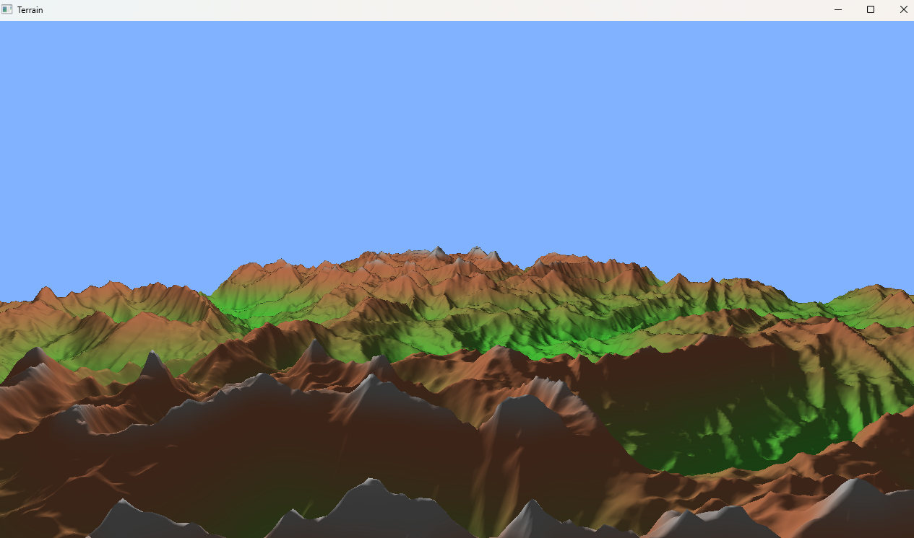

    

# Procedural Terrain Renderer

A real-time procedural terrain renderer written in C++ using OpenGL 3.3 Core Profile. The terrain is generated entirely procedurally on the CPU using fractal Brownian motion (fBm) with domain warping, then shaded with Phong lighting and height-based color blending.

## Features

- 12-octave ridged fBm terrain generation
- Per-octave domain warping and rotation to reduce repeating patterns
- Large-scale continent mask for shaping mountains and plains
- Normals computed from neighboring height samples
- Height-based terrain colors (grass, dirt, rock, and snow)
- Free-look camera with WASD movement and mouse controls

## Dependencies

- GLFW
- GLAD
- GLM
- stb_perlin / stb_image

## Controls

- **WASD:** Move
- **Mouse:** Look around

## Future Improvements

- Atmospheric fog
- GPU-based terrain generation using compute shaders
- Texture splatting
- Slope-based material blending
- Water rendering with Fresnel reflections
- Skybox rendering
- Chunked LOD terrain
- Shadow mapping